<p align="center">
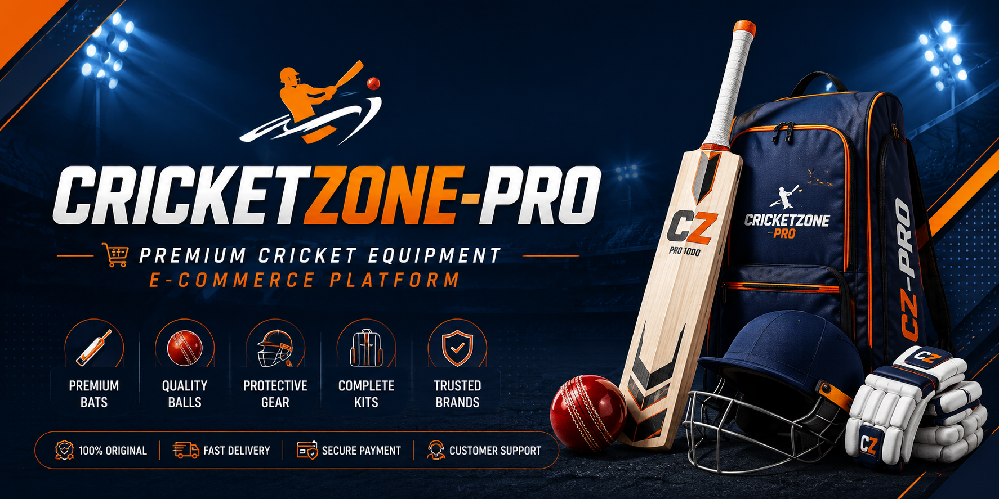
</p>

<h1 align="center">
🏏 CricketZone-Pro
</h1>

<p align="center">
A Modern Full-Stack Cricket Equipment E-Commerce Platform built with Flask, SQLAlchemy, Razorpay, Bootstrap 5, and SQLite.
</p>

<p align="center">


</p>

---

# ✨ Key Highlights

- 🏏 Premium Cricket Equipment Store
- 🔍 Smart Product Search
- 👤 User Authentication System
- 📧 Email Verification
- 💳 Razorpay Payment Gateway
- 📨 HTML Order Confirmation Emails
- 📦 Order Tracking System
- 🛒 Secure Product Purchase Flow
- 📱 Fully Responsive Design
- 🔒 Security Best Practices

---

# 📋 Table of Contents

- Overview
- Features
- Technology Stack
- Project Architecture
- Shopping Workflow
- Screenshots
- Installation
- Folder Structure
- Security Features
- Future Improvements
- Author

---

# 📖 Overview

CricketZone-Pro is a modern Flask-based e-commerce application developed for purchasing premium cricket equipment including bats, balls, and cricket kits.

The project demonstrates a complete online shopping workflow, beginning with user registration and email verification, followed by secure authentication, product browsing, Razorpay-powered online payment, automated email confirmation, and order tracking.

Unlike a basic CRUD application, CricketZone-Pro simulates a real-world e-commerce platform by combining responsive frontend design, secure backend development, payment integration, transactional email services, authentication, and production-ready project architecture.

---

# 🚀 Core Features

## 👤 Customer

- Create Account
- Email Verification
- Secure Login & Logout
- Browse Products
- Search Products
- View Product Details
- Purchase Products
- Razorpay Payment
- Receive Order Confirmation Email
- Track Orders
- Responsive Shopping Experience

---

## 🔐 Authentication System

- User Registration
- Secure Password Hashing
- Email Verification
- Session Management
- Login Required Checkout
- Logout
- Resend Verification Email
- Duplicate Email Prevention
- Generic Login Error Messages

---

## 🛒 Shopping System

- Product Categories
- Cricket Bats
- Cricket Balls
- Cricket Kits
- Product Search
- Product Detail Pages
- Same Brand Recommendations
- Stock Validation
- Order Placement

---

## 🛠️ Administrator

- Secure Admin Authentication
- Dashboard Overview
- Manage Cricket Bats
- Manage Cricket Balls
- Manage Cricket Kits
- Add New Products
- Edit Product Details
- Delete Products
- Update Stock Quantity
- Manage Customer Orders
- View Payment Status
- Order Status Management

---

## 💳 Payment System

- Razorpay Payment Gateway Integration
- Secure Online Payments
- Razorpay Checkout
- Server-side Payment Verification
- Payment Signature Validation
- Payment Success Confirmation
- Failed Payment Handling
- Cancel Payment Handling

---

## 📧 Email Notification System

- Email Verification
- HTML Welcome Email
- HTML Order Confirmation Email
- Order Summary
- Unique Order ID
- Customer Information
- Product Details
- Payment Status
- Automatic Email Delivery

---

# 💻 Tech Stack

| Category | Technologies |
|----------|--------------|
| **Backend** | Python, Flask, SQLAlchemy |
| **Frontend** | HTML5, CSS3, Bootstrap 5, JavaScript |
| **Database** | SQLite |
| **Authentication** | Flask Session, Werkzeug Password Hashing |
| **Payment Gateway** | Razorpay (Test Mode) |
| **Email Services** | Flask-Mail, Gmail SMTP |
| **Template Engine** | Jinja2 |
| **Environment Variables** | python-dotenv |
| **Version Control** | Git & GitHub |
| **Deployment** | PythonAnywhere |

---

# 🏗️ Application Architecture

```text
                    User Browser
                         │
                         ▼
              Flask Application (app.py)
                         │
 ┌───────────────┬───────────────┬───────────────┐
 │               │               │               │
 ▼               ▼               ▼               ▼
Authentication  Products       Orders      Admin Panel
 Module         Module         Module        Module
 │               │               │               │
 └───────────────┴───────┬───────┴───────────────┘
                         ▼
                  Utility Services
       ┌─────────────┬─────────────┐
       ▼             ▼             ▼
 Authentication   Email Service   Payment Service
                   (Flask-Mail)     (Razorpay)
                         │
                         ▼
                  SQLite Database
```

The application follows a modular Flask Blueprint architecture where authentication, products, orders, payments, and email services are separated into independent modules for maintainability and scalability.

---

# 🏗️ System Architecture

CricketZone-Pro follows a modular Flask architecture using Blueprints, SQLAlchemy ORM, and utility modules. Authentication, product management, payment processing, email services, and order management are separated into dedicated modules, making the application scalable and easy to maintain.

### Main Modules

- Authentication
- Product Management
- Shopping System
- Search System
- Order Management
- Razorpay Payment Integration
- Email Notification Service
- Admin Dashboard
- Customer Dashboard
- Database Layer

---

## 🛒 Shopping Workflow

```text
Customer
   │
   ▼
Browse Products
   │
   ▼
Search Products
   │
   ▼
View Product Details
   │
   ▼
Login / Signup
   │
   ▼
Email Verification
   │
   ▼
Purchase Product
   │
   ▼
Razorpay Checkout
   │
   ▼
Payment Verification
   │
   ▼
Order Saved
   │
   ▼
Confirmation Email
   │
   ▼
Track Order
```

---

# 📁 Project Structure

```text
cricketzone-pro/
│
├── app.py
├── config.py
├── requirements.txt
├── README.md
├── .env.example
├── instance/
├── screenshots/
│
├── cricketzone/
│   │
│   ├── routes/
│   │   ├── auth.py
│   │   ├── products.py
│   │   ├── orders.py
│   │   ├── admin.py
│   │   └── main.py
│   │
│   ├── templates/
│   ├── static/
│   ├── utils/
│   │   ├── auth.py
│   │   ├── payment.py
│   │   └── email.py
│   │
│   ├── models.py
│   ├── database.py
│   └── __init__.py
│
└── screenshots/
```

---

---

# ⚙️ Local Installation

Follow the steps below to run CricketZone-Pro on your local machine.

## 1️⃣ Clone the Repository

```bash
git clone https://github.com/Awes313/CricketZone-Pro.git
```

```bash
cd CricketZone-Pro
```

---

## 2️⃣ Create Virtual Environment

### Windows

```bash
python -m venv venv
```

Activate the environment:

```bash
venv\Scripts\activate
```

### macOS / Linux

```bash
python3 -m venv venv
```

```bash
source venv/bin/activate
```

---

## 3️⃣ Install Dependencies

```bash
pip install -r requirements.txt
```

---

## 4️⃣ Configure Environment Variables

Create a file named:

```text
.env
```

Add the following variables:

```env
SECRET_KEY=your-secret-key

MAIL_SERVER=smtp.gmail.com
MAIL_PORT=587
MAIL_USE_TLS=True
MAIL_USERNAME=your-email@gmail.com
MAIL_PASSWORD=your-gmail-app-password

ADMIN_USERNAME=admin
ADMIN_PASSWORD=your-admin-password

RAZORPAY_KEY_ID=your_key_id
RAZORPAY_KEY_SECRET=your_key_secret

FLASK_ENV=development
FLASK_DEBUG=True
```

> **Important:** Never commit your `.env` file to GitHub. Store all sensitive credentials securely.

---

## 5️⃣ Initialize the Database

The application automatically creates the SQLite database during the first run if it does not already exist.

If required:

```bash
python app.py
```

---

## 6️⃣ Run the Application

```bash
python app.py
```

The application will be available at:

```
http://127.0.0.1:5000
```

---

# 🔑 Admin Login

The admin panel is intentionally hidden from the public navigation for improved security.

Access it directly using:

```
/admin/login
```

Example:

```
http://127.0.0.1:5000/admin/login
```

Configure the admin credentials in your `.env` file.

---

# 📧 Gmail SMTP Configuration

CricketZone-Pro uses **Flask-Mail** with **Gmail SMTP** to send transactional emails.

### Required Steps

- Enable **2-Step Verification** for your Google account.
- Generate a **Gmail App Password**.
- Use the generated App Password as `MAIL_PASSWORD`.
- Do **not** use your normal Gmail password.

This setup is used for:

- Email Verification
- Order Confirmation Emails
- Future Notification Emails

---

# 💳 Razorpay Configuration

Create a free Razorpay account.

Obtain your:

- Test Key ID
- Test Key Secret

Add them to the `.env` file:

```env
RAZORPAY_KEY_ID=rzp_test_xxxxxxxxx
RAZORPAY_KEY_SECRET=xxxxxxxxxxxxxxxx
```

The application performs:

- Order Creation
- Secure Checkout
- Payment Signature Verification
- Payment Status Validation

before storing any order in the database.

---

# 📊 Database

Current Database:

```
SQLite
```

ORM:

```
SQLAlchemy
```

Main Tables

- Users
- Products
- Orders

The project is designed so it can be migrated to **PostgreSQL** or **MySQL** with minimal configuration changes for production deployments.

---

---

# 📸 Project Screenshots

> **Note:** Save all screenshots inside the `screenshots/` folder using the filenames below.

---

## 🏠 Home Page

The homepage features a premium hero section, featured cricket products, brand highlights, responsive navigation, and a modern e-commerce design.

<p align="center">
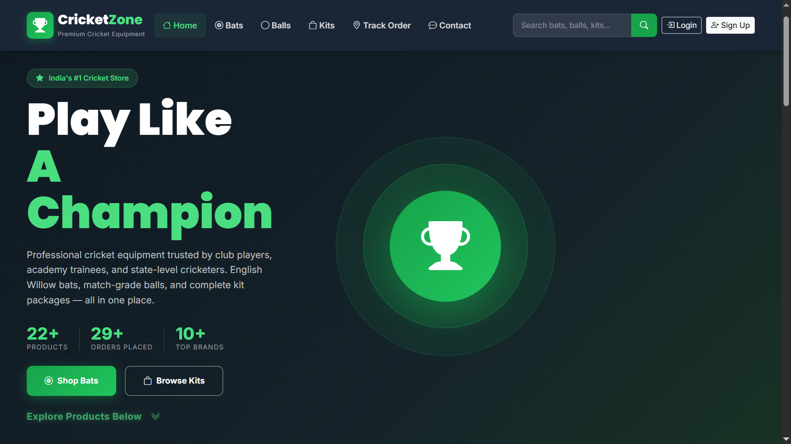
</p>

---

## 🏏 Cricket Bats Collection

Browse a premium collection of English Willow cricket bats from leading brands including MRF, SS, SG, GM, Kookaburra, Spartan, New Balance, Adidas, and Puma.

<p align="center">
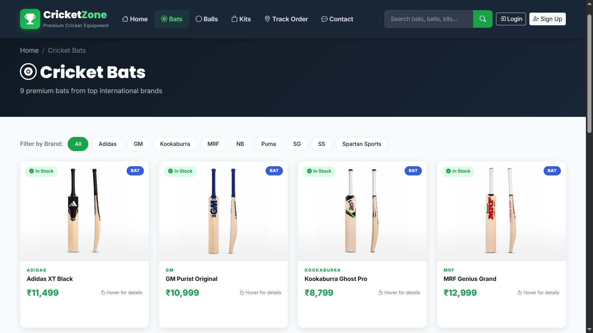
</p>

---

## 🥎 Cricket Balls Collection

Explore match-quality leather cricket balls for Test, ODI, practice, and club cricket from internationally recognized manufacturers.

<p align="center">
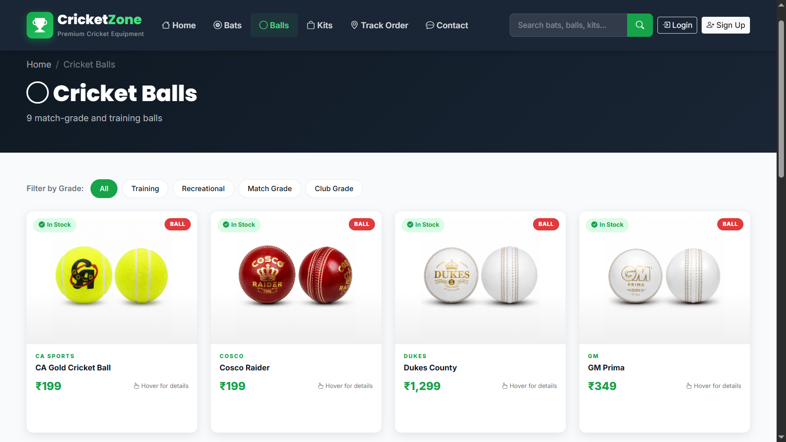
</p>

---

## 🎒 Cricket Kits Collection

Complete cricket kit bundles containing bats, pads, gloves, helmets, guards, and accessories from premium cricket brands.

<p align="center">
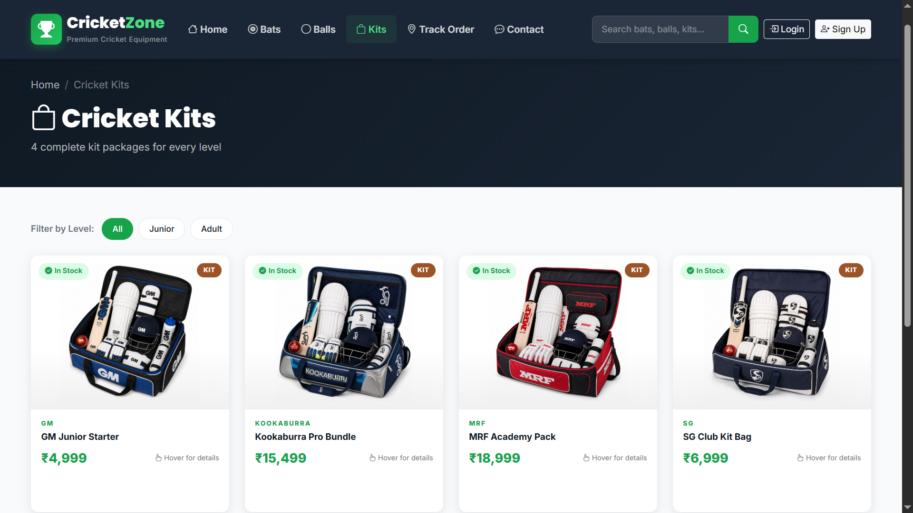
</p>

---

## 🔍 Product Search

Instant product search allowing customers to quickly find cricket equipment by name or brand.

<p align="center">
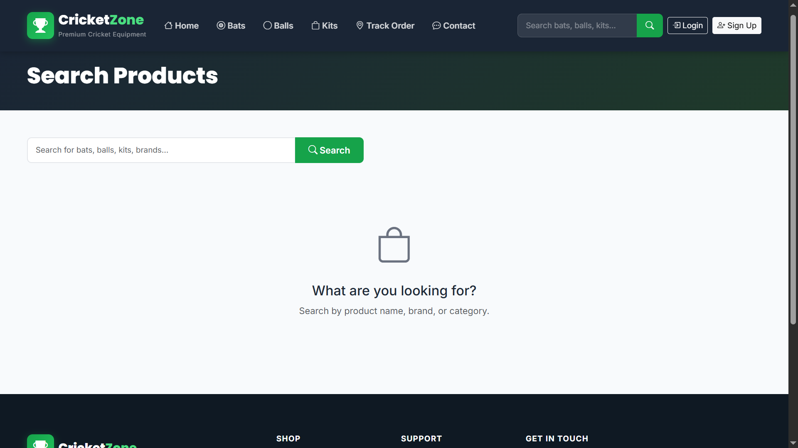
</p>

---

## 📄 Product Details

Dedicated product page displaying:

- Product Images
- Price
- Description
- Brand
- Specifications
- Available Stock
- Purchase Option
- Related Products

<p align="center">
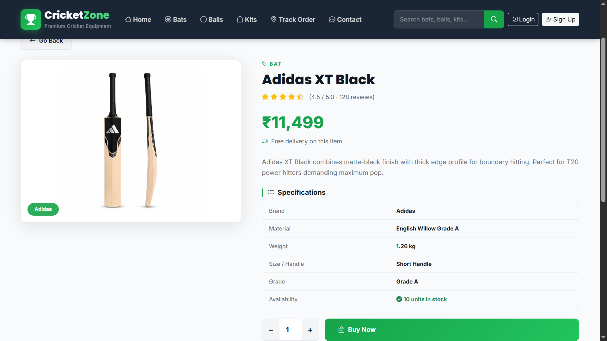
</p>

---

## 👤 User Login

Secure login page with session authentication and friendly validation messages.

<p align="center">
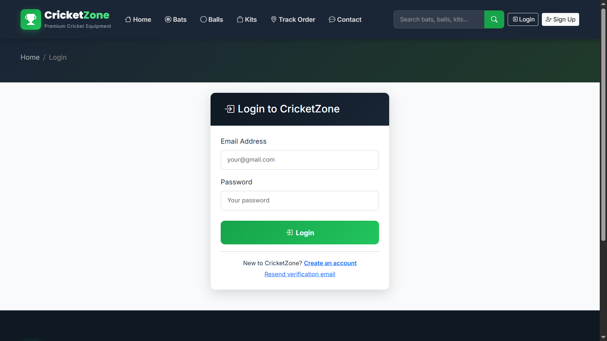
</p>

---

## 📝 User Registration

New customers can create an account with secure password hashing and email verification.

<p align="center">
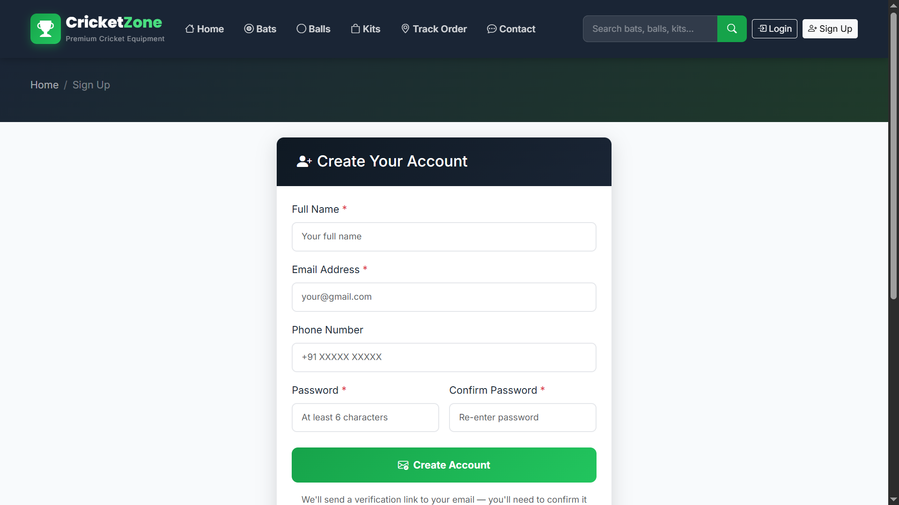
</p>

---

## 📧 Email Verification

Users receive a verification email before activating their account.

<p align="center">
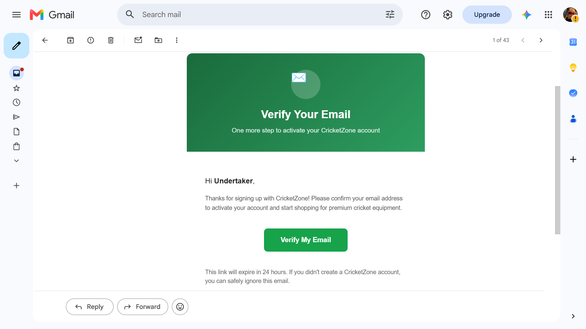
</p>

---

## 💳 Razorpay Secure Checkout

Integrated Razorpay Checkout for secure online payments.

Features include:

- Razorpay Order Creation
- Secure Payment
- Signature Verification
- Payment Validation

<p align="center">
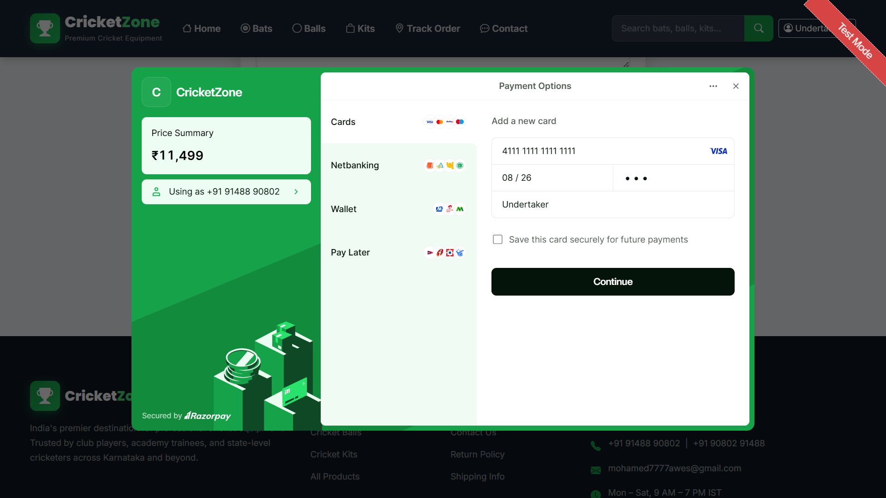
</p>

---

## 📨 Order Confirmation Email

Automatically generated HTML email sent immediately after a successful purchase.

The email contains:

- Customer Name
- Order ID
- Product Information
- Payment Status
- Order Summary

<p align="center">
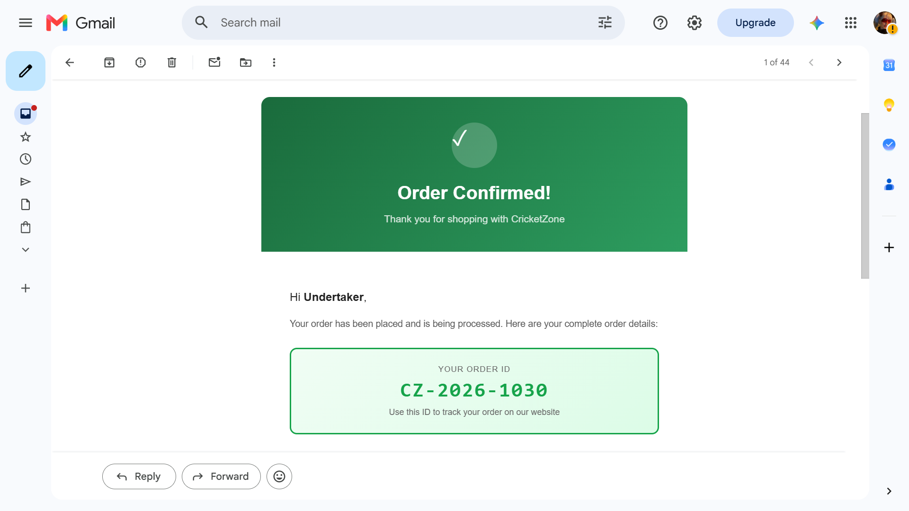
</p>

---

## 📦 Order Tracking

Customers can track their orders using a unique Order ID.

<p align="center">
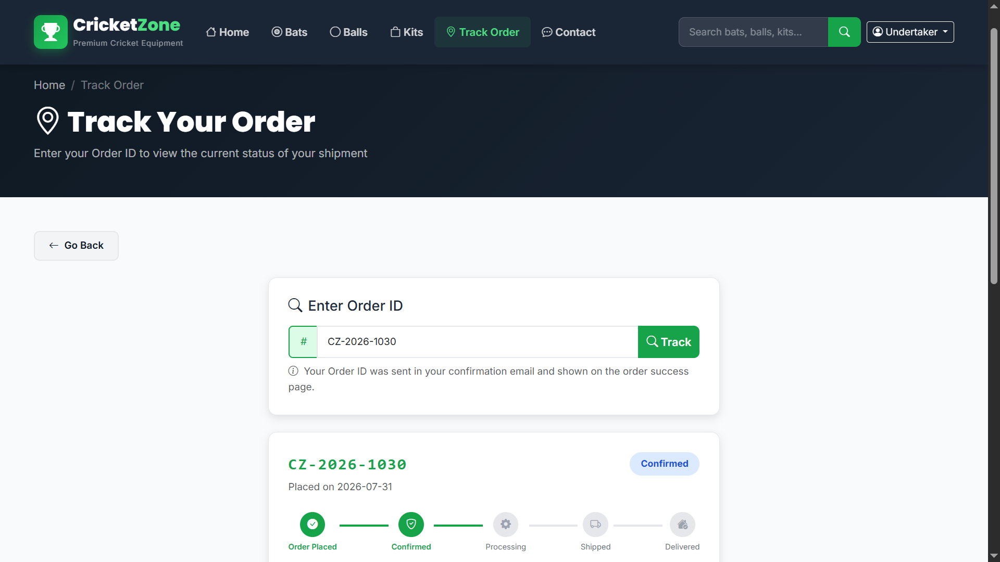
</p>

---

## 🛠️ Admin Dashboard

Administrative dashboard for complete store management.

Features include:

- Product Management
- Order Management
- Stock Updates
- Dashboard Statistics

<p align="center">
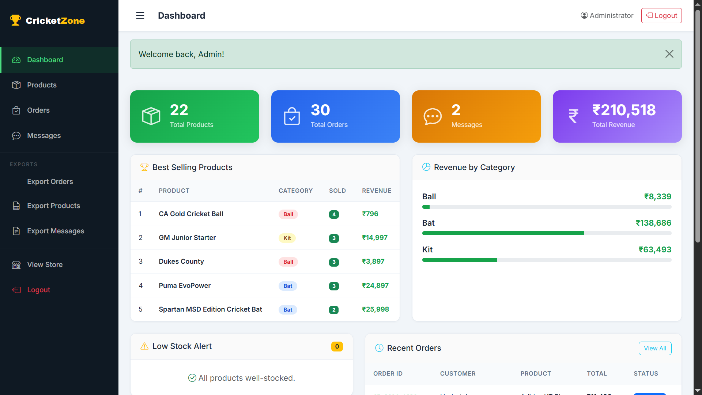
</p>

---

## 📦 Product Management

Admin can:

- Add Products
- Edit Products
- Delete Products
- Manage Stock
- Update Prices

<p align="center">
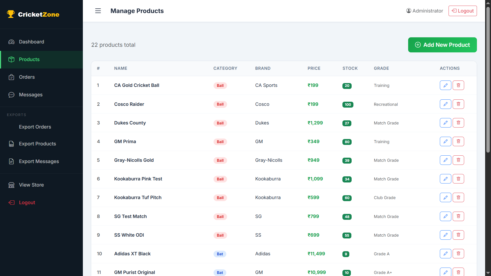
</p>

---

## 📑 Order Management

View customer orders, payment information, stock, and order status from a centralized dashboard.

<p align="center">
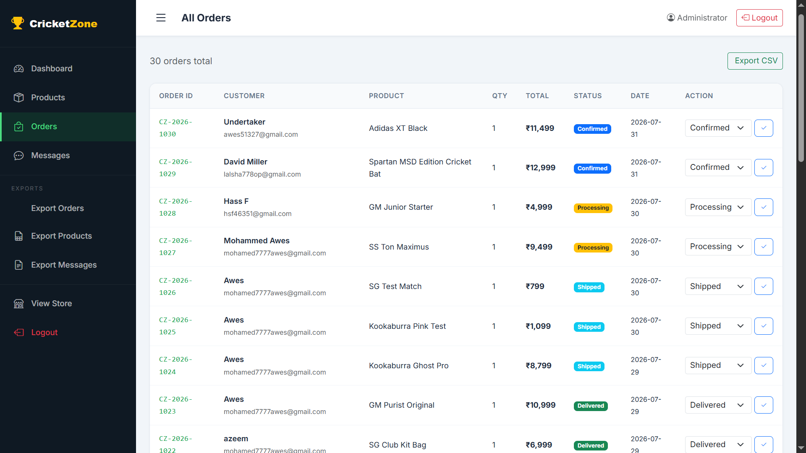
</p>

---

## 📱 Fully Responsive Design

CricketZone-Pro is fully responsive and optimized for:

- Desktop
- Laptop
- Tablet
- Mobile Devices

<p align="center">
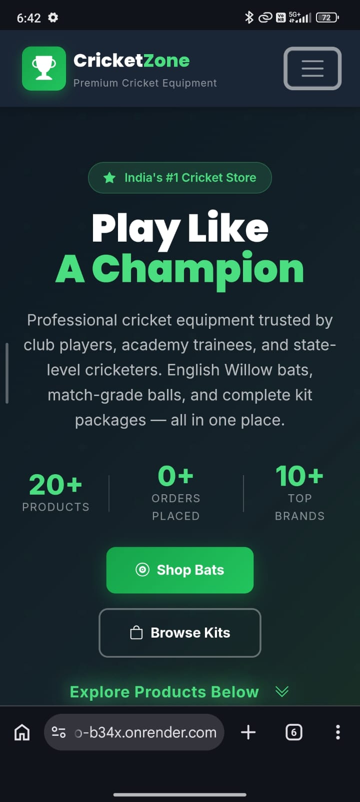
</p>

---

---

# 🔒 Security Features

CricketZone-Pro follows several security best practices commonly used in modern web applications.

### 🔐 Authentication Security

- Secure password hashing using **Werkzeug**
- Session-based authentication
- Login required before placing orders
- Email verification before account activation
- Duplicate email prevention
- Logout session invalidation

---

# 📊 Feature Comparison

| Module | Status |
|----------|:------:|
| User Registration | ✅ |
| Secure Login | ✅ |
| Logout | ✅ |
| Password Hashing | ✅ |
| Email Verification | ✅ |
| Search Products | ✅ |
| Product Categories | ✅ |
| Product Details | ✅ |
| Related Products | ✅ |
| Admin Dashboard | ✅ |
| Add Products | ✅ |
| Update Products | ✅ |
| Delete Products | ✅ |
| Stock Management | ✅ |
| Razorpay Checkout | ✅ |
| Payment Verification | ✅ |
| Order Confirmation Email | ✅ |
| Track Order | ✅ |
| Responsive Design | ✅ |
| SQLite Database | ✅ |

---

### 🛡️ Payment Security

- Razorpay Checkout Integration
- Server-side payment verification
- Razorpay Signature Validation
- Prevents fake payment requests
- Order stored only after successful verification

---

### 📧 Email Security

- Gmail SMTP using App Password
- Environment-based configuration
- HTML email templates
- Automatic order confirmation
- Email verification workflow

---

### 🔒 Application Security

- Environment variables using `.env`
- Hidden admin login route
- Generic authentication error messages
- SQLAlchemy ORM protection against SQL Injection
- Passwords never stored in plain text

---

# 📊 Project Statistics

| Feature | Status |
|----------|--------|
| Responsive Design | ✅ |
| Product Management | ✅ |
| User Authentication | ✅ |
| Email Verification | ✅ |
| Secure Login | ✅ |
| Product Search | ✅ |
| Order Placement | ✅ |
| Razorpay Integration | ✅ |
| Payment Verification | ✅ |
| Order Tracking | ✅ |
| HTML Email Notifications | ✅ |
| Admin Dashboard | ✅ |
| Stock Management | ✅ |
| SQLite Database | ✅ |

---

# ⚡ Performance Highlights

- Responsive Bootstrap 5 UI
- Optimized Flask Blueprint Architecture
- Lightweight SQLite Database
- Modular Code Structure
- Dynamic Jinja2 Templates
- Reusable Components
- Fast Product Search
- Clean URL Routing
- Efficient Database Queries

---

# 🏗️ Engineering Practices

This project was developed using industry-standard software engineering practices.

### ✔ Modular Architecture

- Flask Blueprints
- Utility Modules
- Template Inheritance
- Reusable Components

---

### ✔ Clean Code

- Organized Folder Structure
- Separation of Concerns
- Reusable Helper Functions
- Consistent Naming Conventions

---

### ✔ Database Design

- SQLAlchemy ORM
- Relational Database Model
- Foreign Key Relationships
- Product & Order Management

---

### ✔ UI/UX

- Fully Responsive Layout
- Modern E-commerce Design
- Professional Product Cards
- Interactive User Experience
- Mobile Friendly

---

# 💡 Key Learnings

This project helped strengthen practical knowledge in:

- Flask Application Development
- SQLAlchemy ORM
- User Authentication
- Email Verification
- Session Management
- Razorpay Payment Gateway
- Flask-Mail Integration
- Bootstrap 5 Responsive Design
- Environment Variable Management
- Git & GitHub Workflow
- Production Deployment

---

# 🚀 Future Improvements

The following features are planned for future versions:

- ❤️ Wishlist
- 🛒 Shopping Cart
- 🎟️ Coupon & Discount System
- ⭐ Product Ratings & Reviews
- 📄 PDF Invoice Generation
- 👤 Customer Order History
- 🔔 Low Stock Notifications
- 📊 Sales Analytics Dashboard
- 📈 Product Reports
- 💬 Live Chat Support
- 📱 Progressive Web App (PWA)
- 🐳 Docker Deployment
- 🐘 PostgreSQL Production Database
- ☁️ AWS / Azure Deployment
- 🔄 CI/CD Pipeline
- 📦 REST API Development

---

# 🌟 Why This Project?

Unlike a basic CRUD application, CricketZone-Pro simulates a real-world e-commerce platform by combining secure authentication, payment gateway integration, email automation, product management, responsive UI, and production-ready architecture into a single full-stack application.

It demonstrates both frontend design skills and backend engineering practices expected in modern web development.

---

---

# 🤝 Contributing

Contributions are always welcome!

If you would like to improve CricketZone-Pro:

1. Fork the repository
2. Create a new feature branch

```bash
git checkout -b feature/your-feature-name
```

3. Commit your changes

```bash
git commit -m "Add your feature"
```

4. Push to your branch

```bash
git push origin feature/your-feature-name
```

5. Open a Pull Request

Please ensure your code follows the existing project structure and coding style.

---

# 📄 License

This project is licensed under the **MIT License**.

You are free to use, modify, and distribute this project for educational and personal purposes.

---

# 🙏 Acknowledgements

Special thanks to the following technologies and communities that made this project possible:

- Python
- Flask
- SQLAlchemy
- Bootstrap
- Razorpay
- Flask-Mail
- SQLite
- Jinja2
- Git
- GitHub
- PythonAnywhere

---

# 👨‍💻 Author

## Mohammed Awes

**Python Backend Developer**

📧 **Email**

mohamed7777awes@gmail.com

💼 **LinkedIn**

https://www.linkedin.com/in/awes313/

💻 **GitHub**

https://github.com/Awes313

---

# ⭐ Support

If you found this project helpful, please consider giving it a **Star ⭐** on GitHub.

Your support motivates me to continue building high-quality open-source projects.

---

# ❤️ Thank You

Thank you for visiting **CricketZone-Pro**.

This project demonstrates practical experience in:

- Python
- Flask
- SQLAlchemy
- SQLite
- Bootstrap 5
- Razorpay Payment Gateway
- Flask-Mail
- Authentication
- Email Verification
- Responsive UI Design
- Secure Backend Development

---

<p align="center">

### 🏏 Built with ❤️ using Python & Flask

</p>